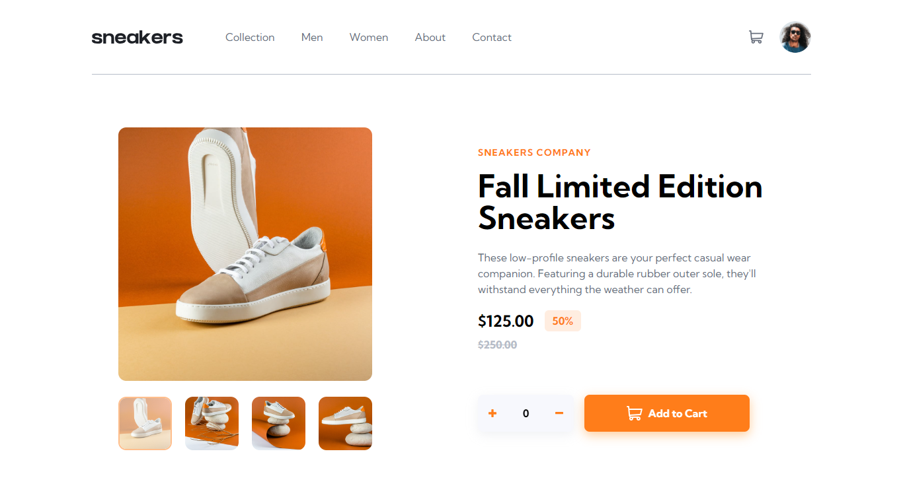
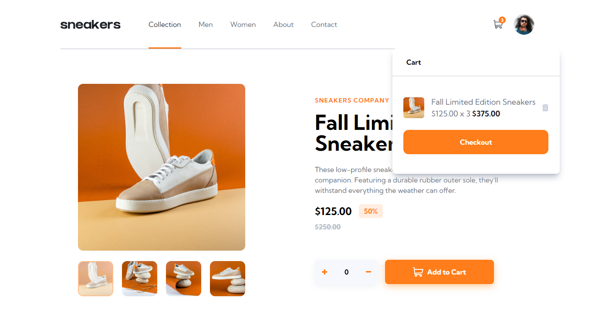

# E-commerce product page

## Table of contents

- [E-commerce product page](#e-commerce-product-page)
  - [Table of contents](#table-of-contents)
  - [Overview](#overview)
    - [The challenge](#the-challenge)
    - [Screenshot](#screenshot)
    - [Links](#links)
    - [Built with](#built-with)

## Overview

### The challenge

- View the optimal layout for the site depending on their device's screen size
- See hover states for all interactive elements on the page
- Open a lightbox gallery by clicking on the large product image
- Switch the large product image by clicking on the small thumbnail images
- Add items to the cart
- View the cart and remove items from it

### Screenshot

### Links

- Solution URL: [GitHub](https://github.com/vensi9/Ecommerce-product-page)
- Live Site URL: [Live-Site](https://semolina-ecommerce-page.netlify.app)

### Built with

- [React](https://reactjs.org/) - A JavaScript library used for building user interfaces.
- [Tailwind CSS](https://tailwindcss.com/) - A utility-first CSS framework for rapidly building custom designs.
- [React Icons](https://react-icons.github.io/react-icons/) - A library providing a set of icons for React applications.
- [React Slick](https://react-slick.neostack.com/) - A carousel component for React applications.
- [Slick Carousel](https://kenwheeler.github.io/slick/) - The core carousel functionality used by React Slick.
- [Tailwind CSS Filters](https://github.com/benface/tailwindcss-filters) - Tailwind CSS plugin providing utility classes for CSS filters.
  
Additionally, the development setup includes:

- [React Scripts](https://create-react-app.dev/docs/available-scripts/) - Utilities and scripts for React development.
- [Web Vitals](https://web.dev/vitals/) - Library for tracking web performance metrics.

